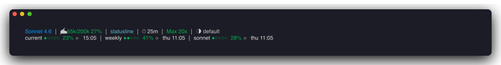
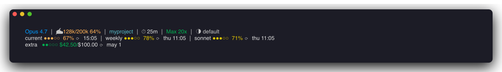
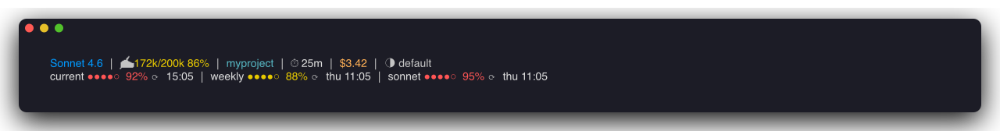

# statusline

A rich, two-line status bar for [Claude Code](https://claude.ai/code) — shows model, context usage, git state, session timer, subscription tier, rate-limit progress bars, and extra-usage credits at a glance.



---

## Features

- **Model + context usage** — current/total tokens with percentage, color-coded by pressure
- **Working directory or git worktree** — whichever applies
- **Git branch + change counts** — staged (`+N`) and modified (`~N`)
- **Session duration** — how long the current session has been running
- **Subscription tier or API cost** — `Max 20x`, `Pro`, etc., or accumulated `$X.XX` in API mode
- **Effort level** — current value of `effortLevel` from `~/.claude/settings.json`
- **Rate-limit progress bars** — five-hour, weekly, weekly-sonnet, with reset times
- **Extra-usage credits** — when enabled on your account, shows `$used / $limit` with reset date
- **Color thresholds** — green &lt; 50%, orange &lt; 70%, yellow &lt; 90%, red ≥ 90%
- **Cached and fast** — &lt;200ms with warm caches; 60s TTL on auth and API data
- **Cross-platform** — macOS Keychain for OAuth credentials, with `~/.claude/.credentials.json` fallback for Linux

## Screenshots

### Typical session


### With extra-usage credits



### API mode under pressure



## Install

```bash
git clone https://github.com/borzov/statusline.git
cd statusline
./install.sh
```

The installer:

1. Backs up any existing `~/.claude/statusline-command.sh` to `*.bak.<timestamp>`.
2. Creates a symlink from `~/.claude/statusline-command.sh` to the file in the repo.
3. Patches `~/.claude/settings.json` to register the status line.

Restart Claude Code to see the new bar.

### Options

```
./install.sh --copy        # copy file instead of symlink (no live updates from git pull)
./install.sh --no-config   # don't touch ~/.claude/settings.json
./install.sh --uninstall   # remove the file and the settings.json entry
```

### Manual install

If you'd rather not run the installer:

```bash
ln -s "$(pwd)/statusline-command.sh" ~/.claude/statusline-command.sh
```

Then add to `~/.claude/settings.json`:

```json
{
  "statusLine": {
    "type": "command",
    "command": "bash /Users/<you>/.claude/statusline-command.sh"
  }
}
```

## Requirements

- `bash` 4+
- `jq`
- `curl`
- macOS Keychain (`security`) for OAuth — falls back to `~/.claude/.credentials.json` on Linux

Install dependencies:

```bash
brew install jq      # macOS
apt install jq       # Debian/Ubuntu
```

## What each segment means

**Line 1 — context**

```
Sonnet 4.6 │ ✍️ 55k/200k 27% │ statusline (main) +2 ~3 │ ⏱ 25m │ Max 20x │ ◑ default
```

| Segment | Meaning |
| --- | --- |
| `Sonnet 4.6` | Model display name |
| `55k/200k 27%` | Tokens used / context window size |
| `statusline (main) +2 ~3` | cwd basename, git branch, +staged ~modified |
| `⏱ 25m` | Session duration |
| `Max 20x` | Subscription tier (or `$1.23` API cost if no subscription) |
| `◑ default` | Effort level from settings.json |

**Line 2 — rate limits**

```
current ●●○○○ 23% ⟳ 15:05 │ weekly ●●○○○ 41% ⟳ thu 11:05 │ sonnet ●○○○○ 28% ⟳ thu 11:05
```

Each segment shows usage bar, percentage, and absolute reset time. Sonnet bar shows separately so you can pace heavy Opus usage.

**Line 3 — extra-usage** (when enabled on your plan)

```
extra ●●○○○ $42.50/$100.00 ⟳ may 1
```

Dollar credits used out of your monthly extra-usage budget.

## How rate-limit data is collected

The script merges two sources:

1. **Native data** from Claude Code's input JSON (`.rate_limits.*`) — preferred for utilization percentages.
2. **OAuth API** at `https://api.anthropic.com/api/oauth/usage` — authoritative for `resets_at`, fallback for utilization when native is missing.

API responses are cached at `/tmp/claude/statusline-usage-cache.json` for 60 seconds. OAuth credentials are read from macOS Keychain (or `~/.claude/.credentials.json`), cached at `/tmp/claude/statusline-auth-cache.json` for 60 seconds.

## Troubleshooting

**Subscription tier shows the wrong value (e.g. `Max 5x` after upgrading to `Max 20x`)**

The OAuth `rateLimitTier` in your keychain is stamped at login time. Re-login via `/login` in Claude Code, then clear the cache:

```bash
rm -f /tmp/claude/statusline-auth-cache.json
```

**Rate-limit line is missing**

Either Claude Code hasn't sent native rate-limit data yet *and* the OAuth API request failed. Check:

```bash
curl -s --max-time 3 \
  -H "Authorization: Bearer $(security find-generic-password -s 'Claude Code-credentials' -w | jq -r '.claudeAiOauth.accessToken')" \
  -H "anthropic-beta: oauth-2025-04-20" \
  https://api.anthropic.com/api/oauth/usage | jq .
```

**Statusline doesn't render at all**

Run the script manually to see errors:

```bash
echo '{"model":{"display_name":"Sonnet"},"context_window":{"context_window_size":200000,"current_usage":{"input_tokens":1000}}}' \
  | bash ~/.claude/statusline-command.sh
```

## Regenerating screenshots

```bash
brew install charmbracelet/tap/freeze
./docs/scripts/screenshot.sh
```

The script seeds deterministic test data into `/tmp/claude/` and renders three scenarios into `docs/screenshots/`.

## License

[MIT](LICENSE)
